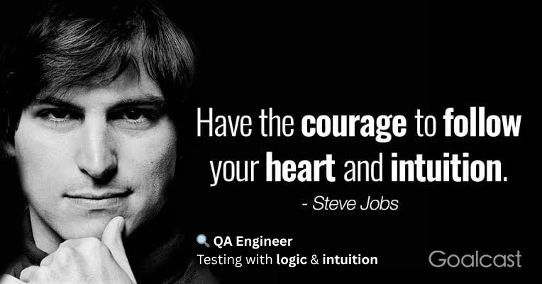

<!--## Hi there 👋

<!--
**TAIEF-HASAN/TAIEF-HASAN** is a ✨ _special_ ✨ repository because its `README.md` (this file) appears on your GitHub profile.

Here are some ideas to get you started:

- 🔭 I’m currently working on ...
- 🌱 I’m currently learning ...
- 👯 I’m looking to collaborate on ...
- 🤔 I’m looking for help with ...
- 💬 Ask me about ...
- 📫 How to reach me: ...
- 😄 Pronouns: ...
- ⚡ Fun fact: ...fdgdffg
-->

 

  

###
<h2 align="left">👋 Hi, I'm Md Taief Hasan</h2>

<h3 align="left">
Full-Stack IoT Architect & Software Quality Automation Engineer
</h3>

I am a passionate engineer with 3+ years of experience bridging the gap between hardware execution and cloud software ecosystems. I specialize in designing fault-tolerant IoT networks, dynamic cloud architectures, micro-zone telemetry algorithms, and robust automation frameworks. I don't just find where systems break—I architect them to never fail 💪

###

  
  
  

<h1>Tech Stack: </h1>

<h2 align="center">⚒️ Tech Stack</h2>

<h3>🧪 QA & Automation</h3>
  
  

 

<h3>💻 Programming</h3>
  

 

<h3>⚙️ Tools & Technologies</h3>
  
  

###

<h2 align="left">🚀 Projects Portfolio</h2>

<h3>🔹 Playwright Automation Testing Project</h3>

<ul>
  <li>🔍 Automated end-to-end test scenarios using Playwright</li>
  <li>📂 Includes UI testing (File Upload, Login, Form validation)</li>
  <li>⚡ Built using TypeScript  & Playwright</li>
  <li>✅ Assertions implemented using expect()</li>
</ul>

###

<h3>🔹 KPM Project Overview</h3>

<ul>
  <li>🔌 Enterprise Decentralized IoT Ecosystem: Powered by standalone dual-core ESP32 edge nodes and real-time Firebase NoSQL streaming pipelines.</li>
  <li>🚨 Automated Micro-Zone Fault Localization: Features an intelligent sequential chaining algorithm that detects line breaks and shrinks lineman searching perimeters to under 500 meters.</li>
  <li>🧠 Intelligent Breaker Trip Decoder: Integrates millisecond Last-Ping Timestamp Analytics and Master-Switch state machines to programmatically differentiate between load-shedding and main breaker trips.</li>
  <li>🔒 Production-Grade Data Masking & PWA: Implements client-side abstract proxies for utility privacy, deployed as an installable standalone application across Windows, Android, and iOS.</li>
</ul>

###

<h1 align="left">🌐 Social Connectivity</h1>

  

  

  

  

  

###

<picture>
  <source 
    media="(prefers-color-scheme: dark)" 
    srcset="https://raw.githubusercontent.com/TAIEF-HASAN/TAIEF-HASAN/output/github-snake-dark.svg?v=2" 
  />

  <source 
    media="(prefers-color-scheme: light)" 
    srcset="https://raw.githubusercontent.com/TAIEF-HASAN/TAIEF-HASAN/output/github-snake.svg?v=2" 
  />

  
</picture>
